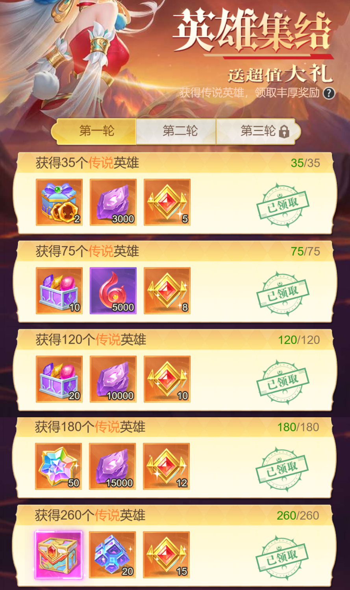

# 小小仙王经验分享

#### 介绍
小小仙王，经验分享 
先说一句：玩游戏开心最重要，建议大家和谐讨论，友好切磋，别让游戏中的发生的不愉快，影响生活中的好心情。 
**以下建议主要针对中、低氪玩家(v11以下)，重氪大佬请忽略**

#### 新区开局攻略

##### 开局十连抽心愿攻略
道具商店两颗，开局日常商店刷新21次内必出一颗（后面就看脸了），刷新的时候记得买竞技凭证，金币的钻石的都可以要，准备好90张，打竞技场90次两颗（90次胜场才行，注意别打高战的），打完竞技商店里面能换四颗，还有一颗在特权商店里面豪华悬赏1980钻石有一颗，加起来一共十颗，直接开局心愿十连抽，欧皇直接出核心40卡起飞。

##### 开局阵容选择
* 开局阵容推荐双风队，双风是风后和紫霞，风后为前期超级主c，所有等级资源优先风后，然后到紫霞，辅助优先度为焰灵姬>毕方>雨师>紧那罗，为什么紧那罗最后呢，首先双风队风系资源紧缺，再养紧那罗狗粮不够了，同时双风队也需要紧那罗也要作为狗粮，还有一个位置给到洛神或者英招或者祝融或者地藏甚至九天玄女先过渡，主要看卡牌，所以前期最理想的阵容是
> 前排：风后，英招（可变动，不行就九天玄女过度，最多金1） 
> 后排：焰灵姬，紫霞仙子，毕方（第六天开助战放助战位，换嫦娥或者更强的辅助，毕方放到助战位就行）

* 前期活动流程 
第五天火锅（可以拿嫦娥和神通和改造神玉和神器玉玺） 
第八天英雄庆典（囤21000砖石买满35张限时召唤券，抽或者留着下次，算好自己资源和财力，不能保证55抽拿下就稳住，最后差1抽氪大金是最亏的，此文作者血泪教训） 
第十天狗狗币活动拉专武， 
前七天三个排行榜，心愿榜和爬塔榜拿的东西最好，值得竞争， 
帮派攻城战氪令牌囤成神材料， 

##### 避雷点
孙悟空别养，七日目标里的孙悟空、青霞仙子、精卫都别买，法器昆仑镜也不买（氪佬请随意） 
心愿全抽光暗属性，心愿积分全换40卡（40卡指的是用40心愿积分换的卡牌，值得换的有：蜘蛛，通天，羲和，后土，哪吒，女娲，青白蛇） 
别养剑圣，别养西王母，别养白骨夫人，别养铁扇公主（早就不是铁扇+哪吒的时代了，实在不想玩蜘蛛的，建议换羲和，推图和做2队输出都挺好用）好感度材料只给40卡，好感度到8级和9级能给一个本体。 
160层无限召唤券刷风后，难刷但坚持就是胜利，前期自选英雄碎片换风后，后期随便，自选精英碎片前期换紫霞后期换心愿石 
* 开区31天0点开始集结活动，当月月底结束（下个月1号会统一出新的集结，持续整个月），有些人开区31天是当月的二十几号，持续时间只有五六天的可以先不开集结，等下个月1号新的集结出来再开，一共三轮（260*3），商店五折突破石可以看情况囤一点（钻少就别买了），中期会缺，爬塔快的高手也可以不买。 
微氪 12~15 天开始囤集结，囤英雄碎片和高级召唤契约和普通召唤契约 
中大氪 15-25 天开始囤集结 

#### 氪金建议
* 先氪一个挂机特权，前期升等必拿 
细节挂机：细节挂机指的是精打细算的挂机，首先咱们卡牌游戏的大佬们都知道等级越高，挂机经验越多，然后一次快速挂机经验是两小时的挂机经验，所以细节挂机就是如果等级在两小时以下就可以升级了，那么咱们就不用快速挂机了，咱们等个一个多小时把等级先升上去，然后快速挂机，这样咱们拿的快速挂机经验更多，然后还有一个细节的点就是打关卡，前期打关卡也有经验能升级，所以咱们记得打完关卡把等级升上去再挂机。

* 开局氪点：
挂机特权，开服专享30元和6元（刚好104激活豪华首充） 
关卡投资98元（202激活典藏赠礼） 
128投资和328投资（冲心愿榜一） 
开服专享两个核心光暗礼包（光暗开局和冲心愿榜） 
契约战令（建议第五天火锅活动出来再拿，性价比高） 
专武战令（拉专武必备，第一个光暗核心C的30级专武提升很大） 
七日投资（可拿，3000钻30抽，还有100光暗商品，欧王出核心） 

#### 初、中期商店攻略
日常商店：金币道具普通寻宝钥匙，普通召唤契约，半价突破石前期可以囤，中后期缺，刷出心愿召唤就买 
道具商店：第一排全买，其他不买，大氪高级寻宝钥匙可以买 
圣辉商店：只换40卡，圣装不要换 
幽冥商店：命格钥匙，前期买紫霞，中后期随便买 
寻宝商店：都是垃圾，有啥买啥，也就专武石头有点用 
远征商店：千机伞，圣兽原石，法宝碎片自选（前期买），太初火种。 
帮派商店：圣兽原石，3星装备（为后面四星套装作准备） 
竞技商店：每周四颗心愿，寻妖罗盘，进阶兽魂，地藏 
跨服商店：女娲，本命神通，轮回之盘，后期法身，轮回之佩 
六道商店：本命神通，原石，专武石头 
神炼商店：心愿，专武箱子，圣装余晖，后期道心自选，镜像水晶 
试剑商店（成神材料）：优先天道残律>元神结晶>其他成神道具>其他 

#### 命运之殿爬塔技巧
爬塔主要人物： 
风后（不死女王，经常一打五拿下，神通：加速闪避（必带神通），摇摆替换神通（吞噬，久战，刺杀，神威，神御）） 
哪吒（切后排达人，配合风后一前一后，神通：久战，吞噬，刺杀，暴击，神威） 
紫霞（偏辅助功能大招有击退效果，伤害高，把敌人推一起，方便风后进去切后排，神通：加速，闪避，沉默，降疗） 
爬塔主要辅助： 
焰灵姬（击退，方便风后进入后排一打五，往往能扭转战局，神通：沉默，降疗，闪避，加速） 
毕方（复活风后，扭转战局，助战位不用带神通） 
嫦娥（400层以上需要，高额恢复） 

#### 装备合成
红色之前的装备，都是3合1，红1之后，都是4合1。 

首先，红色1星装备之前的都不值得合成，因为命运400层之后，会给大量红1星装备 
其次，红1星合成红3星（也就是帮派商店卖的那种），1件红3星装备需要：116*4+164=628w 
> 628w金币，按照5:1兑换成灵力就是125.6w灵力，按照10钻=1w灵力=5w金币来算，相当于花费 1256 钻，合成一个红色3星装备 

如果不小心点一下【一键合成】，一个红3星装备价格可能高达4000w+

#### 关于资源
[TBD]

#### 关于神通
* 关于神通自选箱子。有些神通商店特别难刷出来，建议神通自选箱子选这些：神威，神御，先攻(这个一般其实也不用考虑了，现在绝技队当道，羲和也用不上，已经不适合当前环境)，别的不要选。

#### 神兵
[TBD]

#### 关于英雄集结
第一次集结是开服7天的一个小集结。 
第二次集结是开服第31天0点的第一波大集结，这次集结无论几号开始的，都会在当月最后一天结束。 
第三次及以后的英雄集结，都是常规的每月1号开始，持续整个月。做完3轮如果还有多余的票和碎片，建议囤着下个月集结用。当然，紧缺狗粮或者本体，或者要升级抢活动资源，就果然用吧。

#### 关于狗粮

红色狗粮=3（2+1）个英雄 
粉色狗粮=14（3+11）个英雄 
金色狗粮=40（5+35）个英雄 

注意： 
英雄上彩(永恒阶)需要先有5个金色英雄 
上彩3需要先有5个彩色英雄 
上半神需要先有5个彩5英雄 
英雄上神需要准备的东西很多，后面单开一个说明。

#### Misc
官方资料：穷奇为暗系法师，腾蛇为水系战士，灾厄为火系坦克，执明为光系战士，噬星兽为暗系法师 
命运之殿 800 层开始，要2队 
在这之前，圣墟争夺和试剑活动，已经开始需要2队 
后面有些活动会有第3队要求，但是一般都顾及不上，通常玩法都是优先极限第一队输出，第2队早期一般用紫霞+风后的开局双风队支撑一段时间，然后有资源就转光暗2队，紫霞风后又可以去3队凑合一下。

